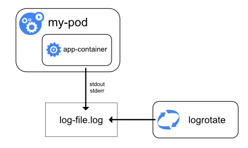
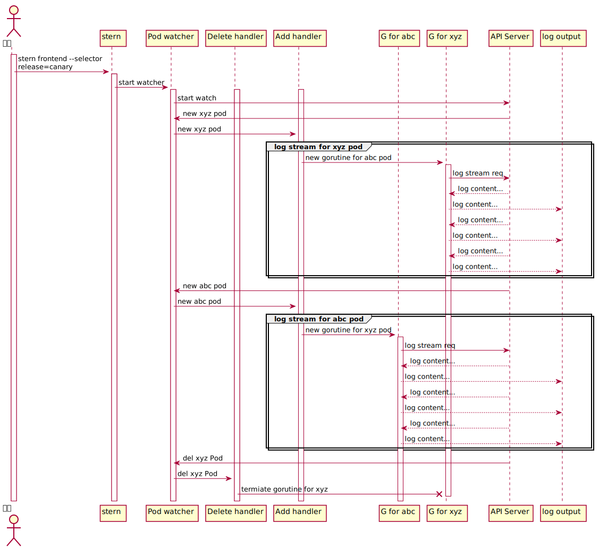

人们通常都使用 kubernetes 命令行工具 kubectl 的 logs 子命令获取 **一个** 集群(取决于 KUBECONFIG 环境变量以及 config file 中设置的 context) 中的实时 log 就像下面这样. 但是在多云部署的场景下, 在这些集群有些未部署集中式日志存储系统的时候, 我们要 debug 一个多云部署的应用(例如一些 controller), 经常需要打开多个 terminal 通过 kubectl 分别与这些 k8s apiserver 建立通信以获取相应的应用日志, 非常不方便. 想着能否实现一个工具来获取多 k8s 的应用实时日志, 本着不重复造轮子的想法, 先在网上搜了些工具, 发现它们基本都是针对单个集群的实现, 后来看到 stern, 看了下它的设计非常的精巧, 能够动态的根据设置的条件筛选 pods, 就打算对其进行改造以支持多 k8s.

```shell
kubectl logs my-pod                                 # dump pod logs (stdout)
kubectl logs -l name=myLabel                        # dump pod logs, with label name=myLabel (stdout)
kubectl logs my-pod --previous                      # dump pod logs (stdout) for a previous instantiation of a container
kubectl logs my-pod -c my-container                 # dump pod container logs (stdout, multi-container case)
kubectl logs -l name=myLabel -c my-container        # dump pod logs, with label name=myLabel (stdout)
kubectl logs my-pod -c my-container --previous      # dump pod container logs (stdout, multi-container case) for a previous instantiation of a container
kubectl logs -f my-pod                              # stream pod logs (stdout)
kubectl logs -f my-pod -c my-container              # stream pod container logs (stdout, multi-container case)
kubectl logs -f -l name=myLabel --all-containers    # stream all pods logs with label name=myLabel (stdout)
kubectl logs deploy/my-deployment                   # dump Pod logs for a Deployment (single-container case)
kubectl logs deploy/my-deployment -c my-container   # dump Pod logs for a Deployment (multi-container case)
```


## kubectl logs 工作原理
那么上面 kubectl logs 背后的工作原理是怎么样的呢?



k8s 中, 容器化的应用输出到 stdout / stderr 的时候, 容器引擎(docker 等)将其重定向到 logging 驱动里(默认 json 格式的文件里). 但我们敲上面的 kubectl logs 命令的时候, kubectl 与 APIServer 交互, APIServer 又与相应 node 上的 kubelet 交互(默认 10250 端口)以获取日志, kubectl 实际发出去的请求包括:


- kubectl logs <pod> : GET

  /containerLogs/{namespace}/{pod}/{container}
- kubectl logs <pod> --tails=2 : GET

  /containerLogs/{namespace}/{pod}/{container}?tailLines=2
- kubectl logs <pod> -f : GET

  /containerLogs/{namespace}/{pod}/{container}?follow=true
- kubectl logs <pod> --since=1m : GET

  /containerLogs/{namespace}/{pod}/{container}?sinceSeconds=60
- kubectl logs <pod> -p=true : GET

  /containerLogs/{namespace}/{pod}/{container}?previous=true
- kubectl logs <pod> --limit-bytes=1 : GET

  /containerLogs/{namespace}/{pod}/{container}?limitBytes=1
- kubectl logs <pod> --timestamps=true : GET

  /containerLogs/{namespace}/{pod}/{container}?timestamps=true


## stern 的使用工作原理

```shell
# 在 staging 这个 context 下, 持续获取 pod 名称中包含 envvars 的 pods 里的 gateway container 中的日志
stern envvars --context staging --container gateway

# 获取 staging namespace 下, 除了 istio-proxy 容器的所有 pods 的所有日志
stern -n staging --exclude-container istio-proxy .

# ...

# 获取名称中包含 frontend 的 pods, 并且打了 release=canay 标签的所有日志
stern frontend --selector release=canary
```

上面的例子可以看出来 [stern](https://github.com/wercker/stern) 相对于 kubectl 更加灵活, 比如上面 envvars 的例子, 随着其 deployment 的 patch 动作, pods 实例也发生相应的变化, stern 能够自动移除不符合条件的 pods 并添加符合条件的 pods.



## 基于 stern 实现多 kubernetes 的支持
从上面 stern 的 sequnce UML 可以发现, 我们仅需在 stern 启动阶段, watch 多个 k8s API server, 其他部分不需要做任何改动即可支持多集群. 但是简单起见, 我们可以直接从多 config file 启动多 stern 实例(见下方代码). 

```go
wg := sync.WaitGroup{}
for _, kubeConfig := range kubeConfigs {
	configForCluster := *config
	configForCluster.KubeConfig = kubeConfig
	wg.Add(1)
	go func() {
		defer wg.Done()

		err = stern.Run(ctx, &configForCluster)
		if err != nil {
			fmt.Println(err)
		}
	}()

}
wg.Wait()
```

命令行参数改动:
>  -m, --multiple enable multiple kubernetes mode (default true)

stern 命令上添加 -m 参数后, 它会从 ~/.kube/ 读取所有的 config files, 并 watch 所有的集群.

从 stern 库 forked 一个并命名为 [mktail](https://github.com/zhengzhou1992/mktail) (multiple kubernetes tail), 支持多集群的 [commit](https://github.com/zhengzhou1992/mktail/commit/f27afb34c5b007911ed81b47a258cf592a1084fe).

为什么不提 PR? 这种一个 config file 一个 k8s 集群的方式有待探讨和改进, 展示不提.

### 编译和使用
```shell
git pull https://github.com/zhengzhou1992/mktail.git
cd mktail && go build -o mktail main.go

./mktail -h
```